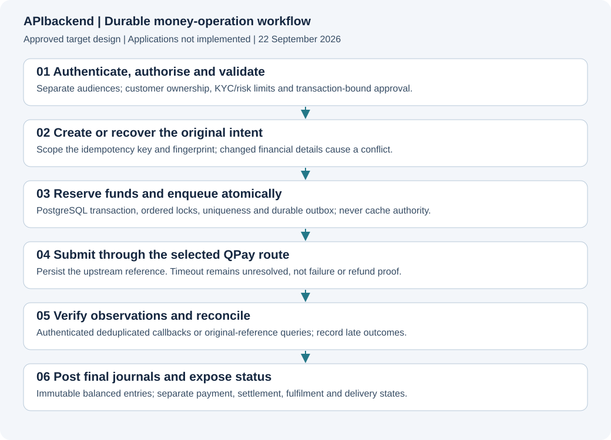

# APIbackend — persistent Go financial API

**Approved stack:** Go + chi + PostgreSQL. API, worker, scheduler, migration and controlled administration are separate processes from one codebase. Customer financial authority stays here; web/mobile/admin do not directly mutate balances.

**v0.6 parity core:** additive migration two implements the approved customer workflows without rewriting migration one. The expanded domain tests run on real PostgreSQL and the WebApp exercises the same API. This remains a review-stage service with real-provider, full financial operations and production gates. Final CI evidence is tracked separately from local source.

## Purpose and boundaries
Serve customer and staff clients with persistent identity, wallet, payment, support and reporting operations. Unconfigured external execution returns unavailable; it never silently falls back to a simulator. The local profile uses unmistakably synthetic funds and bank/bill values. Actual funding rails, refunds/returns, full reconciliation and production acceptance remain open. Private document storage, scanning adapters, customer lifecycle and bounded internal schedules now have implementations.

## Architecture and visuals


`HTTP API → domain transactions → PostgreSQL ledger/holds/intents → leased worker → selected QPay adapter`. Notification intents use the same database transaction as the event, then the Novu adapter dispatches separately. The API has no invented GUI screenshots. Existing visual is labelled target design; HTTP/SQL test evidence is the appropriate implementation evidence. [Architecture](../devdocs/APIbackend/01-ARCHITECTURE.md).

## Setup, configuration and commands
Local-only start, from the repository root:
```sh
python3 APIbackend/scripts/local_config.py
docker compose --env-file APIbackend/.env.local -f APIbackend/compose.local.yml up --build -d api worker scheduler
```
The API binds loopback port 8080. The migration process must complete before application startup. Generated credentials are fresh, owner-only and never overwritten. Do not commit `.env.local` or secret mounts. See [client setup](docs/CLIENT-INTEGRATION.md) and [runtime operations](docs/OPERATIONS.md). Container acceptance remains unverified until the Compose smoke job passes.

Native Go build and tests require the pinned Go toolchain and dependencies in go.mod/go.sum. Real database tests need an isolated PostgreSQL URL:
```sh
cd APIbackend
go mod verify
go vet ./...
QPF_REQUIRE_POSTGRES=true TEST_DATABASE_URL="$TEST_DATABASE_URL" go test -race -count=1 ./...
go build ./...
go run ./cmd/contracts
node --test clients/client.test.mjs
```
Tests create isolated schemas and remove them. Never use a production database. Missing PostgreSQL fails when QPF_REQUIRE_POSTGRES=true; otherwise those tests explicitly skip.

## Source and API map
| Area | Source |
|---|---|
| Process/configuration wiring | internal/app/app.go and cmd/ |
| Customer/staff auth, MFA, browser reload | internal/service/auth.go, browser.go |
| Ledger, holds, schema and migrations | internal/service/schema.sql, migrate.go, payments.go |
| Financial execution/recovery | internal/service/worker.go; internal/upstream/ |
| Staff approvals/KYC/restrictions | internal/service/operations.go |
| Statements, receipts and comparisons | internal/service/reports.go |
| Support cases and encrypted replies | internal/service/support.go |
| Notification intent/eligibility/dispatch | internal/service/notifications.go |
| Routes, validation and contracts | internal/httpapi/ |
| Browser/native transport helper | clients/client.mjs and client.d.ts |

The running API serves `/openapi.json`; `go run ./cmd/contracts` exports the same route registry into contracts/. Generated static JSON is build output, not a separately edited authority. Some expanded product operations remain deliberately absent. [Workflow specification](../devdocs/APIbackend/03-WORKFLOWS.md).

## Feature and task register
Stable 42-task register preserved. A task is Partial where working code exists but its full original acceptance is unfinished; Planned means the capability is not implemented. This avoids counting tests or scaffolding as full product completion. Named assignees and issue allocation remain unassigned.

<!-- FEATURES:START -->
| ID | Capability / task | Milestone | Priority | Status | Specification | Acceptance and required verification | Source / tests / issue |
|---|---|---|---|---|---|---|---|
| API-001 | Customer registration and verified contacts | M1 | P0 | Partial | [Specification](../devdocs/APIbackend/00-INDEX.md) | Reject duplicate and enumeration abuse without leaking identity | internal/service/auth.go; registration/challenge tests; real email transport acceptance pending |
| API-002 | Customer sessions and devices | M1 | P0 | Partial | [Specification](../devdocs/APIbackend/00-INDEX.md) | Rotate and revoke sessions with cross-device recovery tests | auth.go and browser.go; cookie/bearer and refresh-reuse tests; final rerun outstanding |
| API-003 | Separate staff identity and permissions | M1 | P0 | Partial | [Specification](../devdocs/APIbackend/00-INDEX.md) | Reject customer tokens and unauthorised operator actions | operations.go and HTTP staff boundary; invite lifecycle and final acceptance pending |
| API-004 | KYC cases and policy-based tiers | M2 | P0 | Partial | [Specification](../devdocs/APIbackend/00-INDEX.md) | Document decisions and enforce approved policy on every money action | KYC case/manual independent approval implemented; evidence ownership and KYC provider pending |
| API-005 | Partner account provisioning | M2 | P0 | Planned | [Specification](../devdocs/APIbackend/00-INDEX.md) | Recover duplicate or ambiguous provisioning without creating unrelated accounts | Partner account provisioning and customer funding instructions not implemented |
| API-006 | PostgreSQL schema and migrations | M1 | P0 | Partial | [Specification](../devdocs/APIbackend/00-INDEX.md) | Clean setup and compatible migrations pass against real PostgreSQL | schema.sql and migrate.go; PostgreSQL migration tests executed in candidate suite |
| API-007 | Balanced append-only ledger | M1 | P0 | Partial | [Specification](../devdocs/APIbackend/00-INDEX.md) | Every journal balances and corrections preserve original postings | schema.sql journal/posting triggers and payments.go; immutable/balanced ledger tests |
| API-008 | Atomic available funds and holds | M1 | P0 | Partial | [Specification](../devdocs/APIbackend/00-INDEX.md) | Concurrent debit tests cannot overspend or double-release holds | hold trigger and locked payment transaction; concurrent overspend and capture tests |
| API-009 | Lossless money and currency encoding | M1 | P0 | Partial | [Specification](../devdocs/APIbackend/00-INDEX.md) | Round-trip large minor-unit amounts across all clients without precision loss | model.go Money string encoding; boundary/float/negative tests |
| API-010 | Versioned quotes fees and limits | M2 | P0 | Partial | [Specification](../devdocs/APIbackend/00-INDEX.md) | Reject changed or expired quotes and audit effective policy versions | immutable quotes and versioned policy; full tier/provider repricing qualification pending |
| API-011 | Durable idempotent financial intents | M1 | P0 | Partial | [Specification](../devdocs/APIbackend/00-INDEX.md) | Same key replays safely and changed payload conflicts | owner/key fingerprint and quote binding; concurrent replay tests |
| API-012 | Transactional outbox and workers | M1 | P0 | Partial | [Specification](../devdocs/APIbackend/00-INDEX.md) | Recover worker crashes without losing work or duplicating financial effect | PostgreSQL leased payment jobs and notification intents; operational recovery still requires acceptance |
| API-013 | Authenticated durable callback inbox | M2 | P0 | Planned | [Specification](../devdocs/APIbackend/00-INDEX.md) | Reject forgery and deduplicate scoped late or reordered events | Verified upstream callback inbox and funding producer not implemented |
| API-014 | Bank and virtual-account funding | M2 | P0 | Partial | [Specification](../devdocs/APIbackend/00-INDEX.md) | Verified credits reconcile and unmatched receipts enter investigation | Idempotent CreditFunding primitive tested; bank provisioning/callback integration not implemented |
| API-015 | Bank directory and account-name enquiry | M2 | P0 | Partial | [Specification](../devdocs/APIbackend/00-INDEX.md) | Use authoritative enquiry and control enumeration and stale results | upstream/qpay.go and local simulator; real upstream capability acceptance pending |
| API-016 | Persistent scoped beneficiaries | M2 | P0 | Partial | [Specification](../devdocs/APIbackend/00-INDEX.md) | Cross-customer access fails and edited beneficiaries require valid reauthorisation | owned enquiries and beneficiaries; current account enquiry at quote creation |
| API-017 | Internal wallet transfers | M2 | P0 | Partial | [Specification](../devdocs/APIbackend/00-INDEX.md) | Both sides post atomically with correct authorisation and limits | atomic two-wallet posting; internal transfer and concurrent overspend tests |
| API-018 | External bank transfers | M2 | P0 | Partial | [Specification](../devdocs/APIbackend/00-INDEX.md) | Binding quote and durable intent produce a queryable supported result | external holds and original-reference worker; QPay sandbox/live acceptance pending |
| API-019 | Ambiguous-operation recovery | M2 | P0 | Partial | [Specification](../devdocs/APIbackend/00-INDEX.md) | Timeout followed by late success never triggers a second payout | timeout/crash query-only recovery; operational reconciliation of undiscoverable originals pending |
| API-020 | Canonical biller and product catalogue | M3 | P0 | Partial | [Specification](../devdocs/APIbackend/00-INDEX.md) | Version and map upstream products without duplicate or unavailable offerings | bounded QPay catalogue adapter; full provider catalogue pagination/coverage pending |
| API-021 | Bill validation and authoritative quote | M3 | P0 | Partial | [Specification](../devdocs/APIbackend/00-INDEX.md) | Require applicable customer validation and reject stale product pricing | amount-bound bill validation and quotes; provider-specific acceptance pending |
| API-022 | Bill vend and token recovery | M3 | P0 | Partial | [Specification](../devdocs/APIbackend/00-INDEX.md) | Track financial outcome separately from token delivery and recover delayed fulfilment | financial/fulfilment state separation and encrypted token recovery; provider acceptance pending |
| API-023 | Refunds returns and disputes | M3 | P0 | Partial | [Specification](../devdocs/APIbackend/00-INDEX.md) | Apply supported linked compensating operations without erasing history | dispute case records exist; actual returns/refunds and compensating execution not implemented |
| API-024 | Three-way reconciliation | M2 | P0 | Partial | [Specification](../devdocs/APIbackend/00-INDEX.md) | Match product ledger upstream and settlement evidence and expose aged breaks | imported-record comparison exists; complete three-way reconciliation remains outstanding |
| API-025 | Provider float and settlement | M4 | P0 | Planned | [Specification](../devdocs/APIbackend/00-INDEX.md) | Detect low float and reconcile settlement and fee obligations | Automated treasury/float/settlement management not implemented |
| API-026 | Risk rules and account restrictions | M2 | P0 | Partial | [Specification](../devdocs/APIbackend/00-INDEX.md) | Enforce server-side restrictions with reason codes and audit | manual restrictions and financial eligibility checks; automated risk controls pending |
| API-027 | Audit and independent approval engine | M1 | P0 | Partial | [Specification](../devdocs/APIbackend/00-INDEX.md) | Reject self-approval and preserve immutable evidence for privileged changes | limited versioned maker-checker actions; broader approval coverage pending |
| API-028 | History statements and receipts | M2 | P0 | Partial | [Specification](../devdocs/APIbackend/00-INDEX.md) | Export scoped authoritative transactions without false success receipts | scoped ledger/payment history, JSON/CSV statements and success receipts; expanded export lifecycle pending |
| API-029 | Notification delivery lifecycle | M2 | P0 | Partial | [Specification](../devdocs/APIbackend/00-INDEX.md) | Retry and track channel failures without altering financial outcome | durable intents, Novu trigger adapter and policy endpoint; delivery callbacks/unsubscribe/live setup pending |
| API-030 | Support and complaints API | M3 | P0 | Partial | [Specification](../devdocs/APIbackend/00-INDEX.md) | Link cases to scoped operations with escalation and resolution history | owned cases, encrypted replies and staff support operations; SLA/inbound/attachments pending |
| API-031 | Private documents and retention | M1 | P0 | Planned | [Specification](../devdocs/APIbackend/00-INDEX.md) | Expire signed access and enforce approved retention and legal holds | Private document ownership, upload scanning, signed access and retention not implemented |
| API-032 | OpenAPI schemas and generated clients | M1 | P0 | Partial | [Specification](../devdocs/APIbackend/00-INDEX.md) | Validate contracts and detect breaking client drift | route-generated OpenAPI, transport helper and TypeScript definitions; final generated-contract verification pending |
| API-033 | Metrics logs and traces | M1 | P0 | Partial | [Specification](../devdocs/APIbackend/00-INDEX.md) | Correlate intent and provider events while redacting sensitive data | structured redacted logs, health endpoints and request IDs; full metrics/tracing pending |
| API-034 | Distributed abuse controls | M1 | P0 | Partial | [Specification](../devdocs/APIbackend/00-INDEX.md) | Limits remain effective across instances and identity enquiry channels | PostgreSQL-backed request/login/challenge/PIN limits; distributed load and proxy policy acceptance pending |
| API-035 | Key rotation and off-host recovery | M4 | P0 | Partial | [Specification](../devdocs/APIbackend/00-INDEX.md) | Restore keys and data independently and reconcile pending operations | AES-GCM keyring supports historical keys; independent rotation/restore drill not performed |
| API-036 | Load concurrency and release evidence | M4 | P0 | Partial | [Specification](../devdocs/APIbackend/00-INDEX.md) | Execute financial failure suites and meet approved operating objectives | real PostgreSQL/race suite added; final rerun, load and container acceptance outstanding |
| API-037 | Recurring mandates and schedules | M5 | P1 | Planned | [Specification](../devdocs/APIbackend/00-INDEX.md) | Decompose epic and prove explicit consent cancellation and duplicate-safe execution | Recurring mandates and scheduling not implemented |
| API-038 | Business KYB bulk payout and payroll | M5 | P1 | Planned | [Specification](../devdocs/APIbackend/00-INDEX.md) | Decompose epic with organisation boundaries approvals and per-item outcomes | Business KYB/payroll/bulk payouts not implemented |
| API-039 | Merchant QR links and collections | M5 | P1 | Planned | [Specification](../devdocs/APIbackend/00-INDEX.md) | Decompose epic with settlement refunds expiry and merchant ownership | Merchant collections/QR/payment links not implemented |
| API-040 | Rewards referrals and budgeting | M5 | P2 | Planned | [Specification](../devdocs/APIbackend/00-INDEX.md) | Decompose epic with reward liability fraud rules and customer disclosure | Rewards/referrals/budgeting not implemented |
| API-041 | Partner APIs and outbound webhooks | M5 | P2 | Planned | [Specification](../devdocs/APIbackend/00-INDEX.md) | Decompose epic with scoped credentials signed events and developer acceptance | Partner APIs and outbound financial webhooks not implemented |
| API-042 | Regulated expansion product families | M6 | P2 | Planned | [Specification](../devdocs/APIbackend/00-INDEX.md) | Split each product into separately approved legal financial and technical work | Separately approved regulated products not implemented |
| API-043 | Customer capabilities personal controls and exact handles | M3 | P0 | Partial | [Parity API](docs/PARITY-API.md) | Owner scoped; current state checked; errors and release gates explicit | internal/service/customer_parity.go; parity domain tests and client integration suite |
| API-044 | One-off bank quotes and direct original lookup | M3 | P0 | Partial | [Parity API](docs/PARITY-API.md) | Owner scoped; current state checked; errors and release gates explicit | internal/service/payments.go; customer_parity.go; parity domain tests and client integration suite |
| API-045 | Private household bills and timestamped biller watches | M3 | P0 | Partial | [Parity API](docs/PARITY-API.md) | Owner scoped; current state checked; errors and release gates explicit | internal/service/bill_management.go; parity domain tests and client integration suite |
| API-046 | Time-zone aware reminder occurrences | M3 | P0 | Partial | [Parity API](docs/PARITY-API.md) | Owner scoped; current state checked; errors and release gates explicit | internal/service/bill_management.go; parity domain tests and client integration suite |
| API-047 | Bounded internal mandates and one-effect scheduler | M3 | P0 | Partial | [Parity API](docs/PARITY-API.md) | Owner scoped; current state checked; errors and release gates explicit | internal/service/mandates.go; parity domain tests and client integration suite |
| API-048 | Requests partial shares and atomic ledger linkage | M3 | P0 | Partial | [Parity API](docs/PARITY-API.md) | Owner scoped; current state checked; errors and release gates explicit | internal/service/money_requests.go; parity domain tests and client integration suite |
| API-049 | Posted-month insights annotations and budgets | M3 | P0 | Partial | [Parity API](docs/PARITY-API.md) | Owner scoped; current state checked; errors and release gates explicit | internal/service/insights.go; parity domain tests and client integration suite |
| API-050 | Checked encrypted private document storage | M3 | P0 | Partial | [Parity API](docs/PARITY-API.md) | Owner scoped; current state checked; errors and release gates explicit | internal/service/private_uploads.go; internal/privateobjects/; parity domain tests and client integration suite |
| API-051 | Resumable identity and immutable review snapshots | M3 | P0 | Partial | [Parity API](docs/PARITY-API.md) | Owner scoped; current state checked; errors and release gates explicit | internal/service/identity_privacy.go; parity domain tests and client integration suite |
| API-052 | WebAuthn credential and ceremony verification | M3 | P0 | Partial | [Parity API](docs/PARITY-API.md) | Owner scoped; current state checked; errors and release gates explicit | internal/service/passkeys.go; parity domain tests and client integration suite |
| API-053 | Dual-mailbox verified email changes | M3 | P0 | Partial | [Parity API](docs/PARITY-API.md) | Owner scoped; current state checked; errors and release gates explicit | internal/service/identity_privacy.go; parity domain tests and client integration suite |
| API-054 | Zero-balance closure and scoped profile export | M3 | P0 | Partial | [Parity API](docs/PARITY-API.md) | Owner scoped; current state checked; errors and release gates explicit | internal/service/identity_privacy.go; parity domain tests and client integration suite |
| API-055 | Support evidence escalation and event history | M3 | P0 | Partial | [Parity API](docs/PARITY-API.md) | Owner scoped; current state checked; errors and release gates explicit | internal/service/support.go; identity_privacy.go; parity domain tests and client integration suite |
| API-056 | Persistent funding provisioning and independent credit verification interface | M3 | P0 | Partial | [Parity API](docs/PARITY-API.md) | Owner scoped; current state checked; errors and release gates explicit | internal/service/funding_accounts.go; parity domain tests and client integration suite |
| API-057 | Additive version-two migrations and contract exports | M3 | P0 | Partial | [Parity API](docs/PARITY-API.md) | Owner scoped; current state checked; errors and release gates explicit | internal/service/migrate.go; parity_v2.sql; internal/httpapi/parity_routes.go; parity domain tests and client integration suite |
| API-058 | Real API browser and private-object regression qualification | M3 | P0 | Partial | [Parity API](docs/PARITY-API.md) | Owner scoped; current state checked; errors and release gates explicit | internal/service/parity_test.go; WebApp/e2e/parity.api.spec.ts; parity domain tests and client integration suite |
<!-- FEATURES:END -->

## Done, pending and blocked
Additive migration two and the parity domain/API components are implemented: exact handles and limits, one-off bank enquiries, original-operation lookup, saved bills, reminders, internal mandates, request shares, monthly insights/budgets, checked private documents, immutable identity review, passkeys, dual-mailbox changes, guarded closure and funding lifecycle/verified-credit interface. [Endpoint map](docs/PARITY-API.md).

Not complete: live funding adapter and provider acceptance; full refund/return execution, treasury and three-way reconciliation; private-store/scanner deployment qualification; automatic identity/liveness; SMS; complete all-record privacy export; full support assignment/SLA/inbound-mail lifecycle; production Novu bridge/provider feedback; external autopay; operational hardening. See [remaining work](docs/REMAINING-WORK.md).

## Tests and evidence
Local Go vet, compilation and expanded real-PostgreSQL domain checks are recorded in [validation](docs/VALIDATION.md). Concurrency tests cover one-effect payments, requests, funding and scheduled occurrences; security tests cover ownership, one-time challenges, passkey ceremony binding and private-object scanner framing. Final race, CI PostgreSQL 18.6, Compose and browser results must be recorded for the exact release revision. No live provider calls occur in these suites.

## Security and permissions
Opaque hashed session credentials; HTTP-only browser cookies with CSRF/origin controls; distinct mobile bearer sessions and staff audience; mandatory staff MFA before operations; Argon2id hashes; AES-GCM purpose-bound encryption; signed private notification requests; rate limits; immutable audit/ledger history. Sensitive mutations recheck current user/session inside their transaction. Every production control still needs independent review and evidence. The local database owner role is not a production least-privilege deployment design.

## Operations, deployment and troubleshooting
Run API, worker and scheduler together, with explicit migrations. Use stable original payment IDs through all retries. Never resolve an unknown transfer by blindly creating another. Investigate dead jobs and retained holds through controlled queries; provider not-found is not proof no money moved. [Operations guide](docs/OPERATIONS.md) covers configuration, local fixtures and release blockers. Production infrastructure, live provider validation, monitoring and independent restore acceptance are not delivered by the local Compose file.

## Roadmap, limitations and maintenance
Read [remaining work](docs/REMAINING-WORK.md). Source, tests, contracts, README and progress updates belong in one reviewed delivery. Re-run the canonical notification catalogue check and documentation generator on changes. Store exact CI commit/result evidence; no manual status promotion to production-ready.

## Changelog
2026-09-23 v0.6: additive customer-parity migration, security, schedules/requests, private documents, identity/account lifecycle, funding interface and domain tests. Existing V1 checksum preserved. [Changelog](CHANGELOG.md).

Delivery recovery: hash-verified application records restored, documentation tail rebuilt and OpenAPI duplication corrected. [Delivery evidence and remaining acceptance](../devdocs/project/GITHUB-DELIVERY.md).
