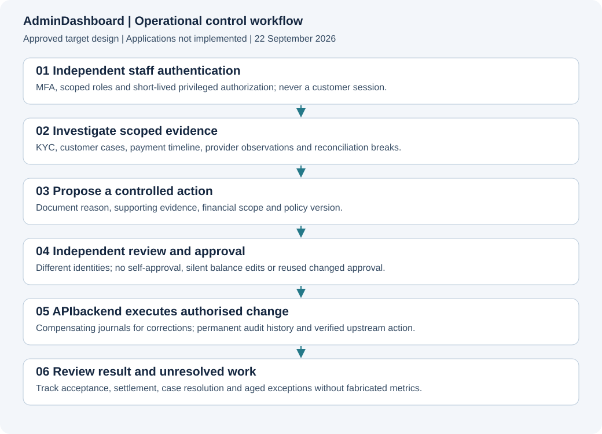

# AdminDashboard

**Status: approved documentation and scaffold.** No runnable application, real product screenshots, implementation tests, provider acceptance or deployment is delivered here. The approved stack is recorded below.

[Project](../README.md) · [Documentation](../devdocs/00-INDEX.md) · [Service specification](../devdocs/AdminDashboard/00-INDEX.md)

**Approved stack:** Bespoke React + TypeScript + Vite + React Router (A1); no Filament. See [ADR-0001](../devdocs/adrs/0001-APPROVED-ARCHITECTURE.md). Alternative stacks are decision history. Product features remain Planned.

## Purpose and boundaries
Staff operations and independent financial oversight. Approved stack: **A1: React + TypeScript + Vite + React Router; approved 2026-09-22**. Financial authority, execution ownership and data boundaries are defined in [Architecture](../devdocs/project/03-ARCHITECTURE.md). Role owner: AdminDashboard engineering; named assignee is unassigned. Financial/security decisions require independent domain review.

## Architecture and visuals

Use the [target architecture](../devdocs/project/03-ARCHITECTURE.md) and [UX/screen inventory](../devdocs/project/09-UX-AND-SCREEN-PLAN.md). These are designs, not screenshots of implemented services. Runtime gallery: not captured. APIbackend uses API/sequence evidence rather than a fictional GUI. Screen provenance is mandatory when executable UI exists.

## Setup, configuration and commands
No application install/build/start command exists yet. Do not invent one or present a mock as an installed product. With the first application implementation, add prerequisites, pinned versions, environment-variable names with safe examples, migrations, local fixtures, development/build/test commands and troubleshooting. Never include live keys or customer data. Documentation-only commands exist in [scripts/docs](../scripts/docs/README.md).

## Source and API map
Application source and executable contracts are not yet created. See [API contract plan](../devdocs/project/06-API-CONTRACT-PLAN.md). Publish actual source paths, entry points, module boundaries and generated-client ownership when implemented. Browser/native secrets and direct database financial mutations are forbidden.

## Feature and task register
Core scope is approved for planning; every entry below remains unimplemented. Growth rows are epics needing decomposition and explicit approval. Service role ownership applies to all rows; dependencies follow [milestones](../devdocs/project/12-ROADMAP.md) and must be expanded in issues before sprint commitment. Source/test/issue evidence is intentionally absent. Verification: Not run. Provider acceptance: Not assessed. Release: Not deployed.

<!-- FEATURES:START -->
| ID | Capability / task | Milestone | Priority | Status | Specification | Acceptance and required verification | Source / tests / issue |
|---|---|---|---|---|---|---|---|
| ADM-001 | Staff invitation authentication and MFA | M1 | P0 | Planned | [Specification](../devdocs/AdminDashboard/00-INDEX.md) | Invite-only access with independent staff session and recovery policy | Not implemented; tests not run; issue not created |
| ADM-002 | Role and permission enforcement | M1 | P0 | Planned | [Specification](../devdocs/AdminDashboard/00-INDEX.md) | Server denies forbidden operations even through direct API requests | Not implemented; tests not run; issue not created |
| ADM-003 | Real operational overview metrics | M2 | P0 | Planned | [Specification](../devdocs/AdminDashboard/00-INDEX.md) | Every displayed metric has a defined authoritative query and error state | Not implemented; tests not run; issue not created |
| ADM-004 | Customer and KYC review | M2 | P0 | Planned | [Specification](../devdocs/AdminDashboard/00-INDEX.md) | Scoped document access supports reasoned decisions and immutable audit | Not implemented; tests not run; issue not created |
| ADM-005 | Restrictions and session controls | M2 | P0 | Planned | [Specification](../devdocs/AdminDashboard/00-INDEX.md) | Approved restrictions take effect immediately in backend authorisation | Not implemented; tests not run; issue not created |
| ADM-006 | Financial transaction timeline | M2 | P0 | Planned | [Specification](../devdocs/AdminDashboard/00-INDEX.md) | Show intent attempts holds journals observations and settlement separately | Not implemented; tests not run; issue not created |
| ADM-007 | Unresolved payment investigation | M2 | P0 | Planned | [Specification](../devdocs/AdminDashboard/00-INDEX.md) | Re-query original operation without offering unsafe resubmit shortcuts | Not implemented; tests not run; issue not created |
| ADM-008 | Maker-checker approvals | M2 | P0 | Planned | [Specification](../devdocs/AdminDashboard/00-INDEX.md) | Different eligible operator approves against current immutable proposal | Not implemented; tests not run; issue not created |
| ADM-009 | Bill catalogue and product management | M3 | P0 | Planned | [Specification](../devdocs/AdminDashboard/00-INDEX.md) | Audit versioned mappings and disable unavailable products safely | Not implemented; tests not run; issue not created |
| ADM-010 | Bill fulfilment and token recovery | M3 | P0 | Planned | [Specification](../devdocs/AdminDashboard/00-INDEX.md) | Distinguish failed delivery from a financially failed vend | Not implemented; tests not run; issue not created |
| ADM-011 | Provider health and capability view | M2 | P0 | Planned | [Specification](../devdocs/AdminDashboard/00-INDEX.md) | Distinguish configured adapter runtime support and financial acceptance | Not implemented; tests not run; issue not created |
| ADM-012 | Pricing limits and policy versions | M2 | P0 | Planned | [Specification](../devdocs/AdminDashboard/00-INDEX.md) | Effective-date changes preserve existing quote history and approval | Not implemented; tests not run; issue not created |
| ADM-013 | Reconciliation imports and matching | M2 | P0 | Planned | [Specification](../devdocs/AdminDashboard/00-INDEX.md) | Validate file scope duplicates completeness and matching outcomes | Not implemented; tests not run; issue not created |
| ADM-014 | Suspense and aged exception resolution | M2 | P0 | Planned | [Specification](../devdocs/AdminDashboard/00-INDEX.md) | Breaks retain owner evidence age and approved resolution | Not implemented; tests not run; issue not created |
| ADM-015 | Treasury float and settlement overview | M4 | P0 | Planned | [Specification](../devdocs/AdminDashboard/00-INDEX.md) | Display verified obligations and funding alerts without mixing revenue with custody | Not implemented; tests not run; issue not created |
| ADM-016 | Refund return and dispute operations | M3 | P0 | Planned | [Specification](../devdocs/AdminDashboard/00-INDEX.md) | Use supported approved compensating flows and evidence | Not implemented; tests not run; issue not created |
| ADM-017 | Risk compliance and investigation cases | M2 | P0 | Planned | [Specification](../devdocs/AdminDashboard/00-INDEX.md) | Enforce case permissions reasons and escalation requirements | Not implemented; tests not run; issue not created |
| ADM-018 | Support and complaint lifecycle | M3 | P0 | Planned | [Specification](../devdocs/AdminDashboard/00-INDEX.md) | Track assignment escalation customer updates and resolution evidence | Not implemented; tests not run; issue not created |
| ADM-019 | Notification templates and delivery | M3 | P1 | Planned | [Specification](../devdocs/AdminDashboard/00-INDEX.md) | Review changes and inspect delivery without exposing sensitive payloads | Not implemented; tests not run; issue not created |
| ADM-020 | Audit search and controlled export | M1 | P0 | Planned | [Specification](../devdocs/AdminDashboard/00-INDEX.md) | Privileged access itself is logged and exports are scoped | Not implemented; tests not run; issue not created |
| ADM-021 | Incident and emergency controls | M4 | P0 | Planned | [Specification](../devdocs/AdminDashboard/00-INDEX.md) | Restrict stop or resume controls with clear blast radius and approval | Not implemented; tests not run; issue not created |
| ADM-022 | Finance and management reports | M3 | P0 | Planned | [Specification](../devdocs/AdminDashboard/00-INDEX.md) | Reports reconcile to ledger and separate income fees float and liabilities | Not implemented; tests not run; issue not created |
| ADM-023 | Accessible independent admin UI | M1 | P0 | Planned | [Specification](../devdocs/AdminDashboard/00-INDEX.md) | Auth shell is separate and staff workflows support keyboard navigation | Not implemented; tests not run; issue not created |
| ADM-024 | Admin E2E and visual evidence | M1 | P0 | Planned | [Specification](../devdocs/AdminDashboard/00-INDEX.md) | Test real permission boundaries and capture synthetic runtime screenshots | Not implemented; tests not run; issue not created |
| ADM-025 | Deployment and operator runbooks | M4 | P0 | Planned | [Specification](../devdocs/AdminDashboard/00-INDEX.md) | Verify clean deployment rollback observability and incident procedures | Not implemented; tests not run; issue not created |
| ADM-026 | Approved business and growth controls | M5 | P1 | Planned | [Specification](../devdocs/AdminDashboard/00-INDEX.md) | Decompose new products with staff finance risk and support ownership | Not implemented; tests not run; issue not created |
<!-- FEATURES:END -->

## Done, pending and blocked
Documentation: this planning README and task register are drafted. Product implementation: zero tasks completed. Pending: 26 planned rows. Decisions: stack and E1 integration approved; contracts, operating authority and provider acceptance remain unresolved. Do not confuse these programme gates with a running system failure. Link named blockers and dependencies as implementation begins.

## Tests and evidence
Product tests: not written or run. [Acceptance plan](../devdocs/project/10-TESTING-AND-ACCEPTANCE.md) defines required suites. Record commit, exact commands, environment, totals and skips; source-discovered tests are not executed results. No financial or security certification is implied by documentation checks.

## Security and permissions
Adopt the [security plan](../devdocs/project/07-SECURITY-AND-COMPLIANCE.md). Separate customer and staff authentication. Enforce API authorisation, object ownership, sensitive-data controls and audited privileged operations. Document a detailed permission matrix before feature implementation.

## Operations, deployment and troubleshooting
Not deployed. Use the [operations plan](../devdocs/project/11-OPERATIONS-AND-DEPLOYMENT.md) to create service-specific release, rollback, logging, incident, key-recovery and data-recovery procedures. Do not modify production to create documentation evidence.

## Roadmap, limitations and maintenance
See [roadmap](../devdocs/project/12-ROADMAP.md). This README is the canonical detailed register; generated FEATURES.json is derived. Root and service statuses, tests, API docs and changed UI captures must accompany every feature delivery. See the [mandatory standard](../devdocs/project/13-DOCUMENTATION-STANDARD.md).

## Changelog
2026-09-22: service boundary, approved stack, acceptance tasks and mandatory documentation obligations recorded. Approved stack recorded and documentation/scaffold prepared for GitHub; no product implementation claimed.

### Self-hosted notification integration
Expose authorised redacted delivery investigations, provider health, suppression and audited resend proposals through Go. Staff email links never approve financial actions; private Novu administration is separate from this dashboard.

The permanent service directory is [Novu](../Novu/README.md), not `Notifications/`. Read [notification contracts](../devdocs/Novu/04-CONTRACTS-AND-DELIVERY.md). Built-in email content is not evidence that this application integration is complete.

### Customer parity integration — 2026-09-23
APIbackend migration two adds owned documents, identity review, personal controls, request/schedule records, funding-adapter lifecycle and insights. Consult [parity API](../APIbackend/docs/PARITY-API.md). This service’s UI/source tasks are still Planned; the WebApp implementation does not automatically complete native mobile or staff-dashboard work.
