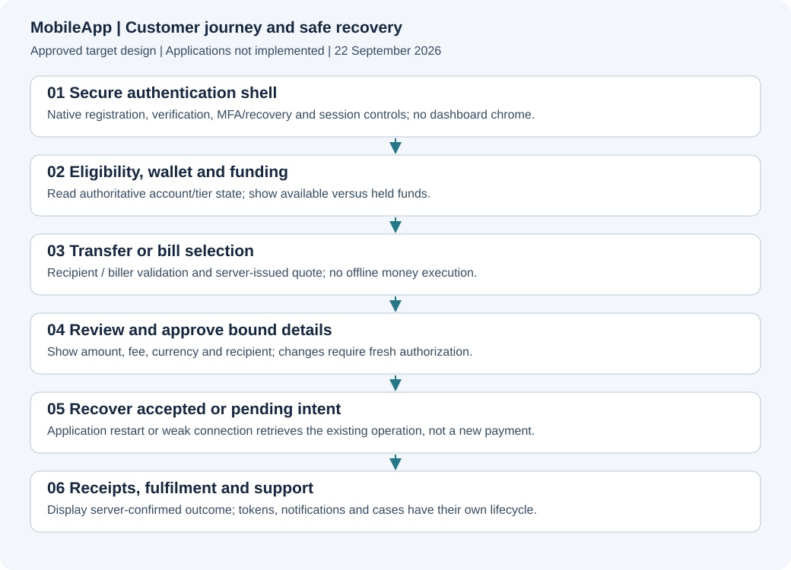

# MobileApp

**Status: approved documentation and scaffold.** No runnable application, real product screenshots, implementation tests, provider acceptance or deployment is delivered here. The approved stack is recorded below.

[Project](../README.md) · [Documentation](../devdocs/00-INDEX.md) · [Service specification](../devdocs/MobileApp/00-INDEX.md)

**Approved stack:** React Native + TypeScript + Expo development builds (M1). See [ADR-0001](../devdocs/adrs/0001-APPROVED-ARCHITECTURE.md). Alternative stacks are decision history. Product features remain Planned.

## Purpose and boundaries
Native customer experience for Android and iOS. Approved stack: **M1: React Native + TypeScript + Expo development builds; approved 2026-09-22**. Financial authority, execution ownership and data boundaries are defined in [Architecture](../devdocs/project/03-ARCHITECTURE.md). Role owner: MobileApp engineering; named assignee is unassigned. Financial/security decisions require independent domain review.

## Architecture and visuals

Use the [target architecture](../devdocs/project/03-ARCHITECTURE.md) and [UX/screen inventory](../devdocs/project/09-UX-AND-SCREEN-PLAN.md). These are designs, not screenshots of implemented services. Runtime gallery: not captured. APIbackend uses API/sequence evidence rather than a fictional GUI. Screen provenance is mandatory when executable UI exists.

## Setup, configuration and commands
No application install/build/start command exists yet. Do not invent one or present a mock as an installed product. With the first application implementation, add prerequisites, pinned versions, environment-variable names with safe examples, migrations, local fixtures, development/build/test commands and troubleshooting. Never include live keys or customer data. Documentation-only commands exist in [scripts/docs](../scripts/docs/README.md).

## Source and API map
Application source and executable contracts are not yet created. See [API contract plan](../devdocs/project/06-API-CONTRACT-PLAN.md). Publish actual source paths, entry points, module boundaries and generated-client ownership when implemented. Browser/native secrets and direct database financial mutations are forbidden.

## Feature and task register
Core scope is approved for planning; every entry below remains unimplemented. Growth rows are epics needing decomposition and explicit approval. Service role ownership applies to all rows; dependencies follow [milestones](../devdocs/project/12-ROADMAP.md) and must be expanded in issues before sprint commitment. Source/test/issue evidence is intentionally absent. Verification: Not run. Provider acceptance: Not assessed. Release: Not deployed.

<!-- FEATURES:START -->
| ID | Capability / task | Milestone | Priority | Status | Specification | Acceptance and required verification | Source / tests / issue |
|---|---|---|---|---|---|---|---|
| MOB-001 | Native SDK compatibility proof | M0 | P0 | Planned | [Specification](../devdocs/MobileApp/00-INDEX.md) | Selected KYC and payment SDKs work in signed Android and iOS development builds | Not implemented; tests not run; issue not created |
| MOB-002 | Independent authentication layouts | M1 | P0 | Planned | [Specification](../devdocs/MobileApp/00-INDEX.md) | Authentication screens have no authenticated dashboard navigation | Not implemented; tests not run; issue not created |
| MOB-003 | Registration and contact verification | M1 | P0 | Planned | [Specification](../devdocs/MobileApp/00-INDEX.md) | Handle resend expiry recovery and enumeration-safe errors | Not implemented; tests not run; issue not created |
| MOB-004 | Secure sessions and device storage | M1 | P0 | Planned | [Specification](../devdocs/MobileApp/00-INDEX.md) | Token rotation revocation and secure-storage edge cases pass | Not implemented; tests not run; issue not created |
| MOB-005 | MFA and transaction-bound approval | M2 | P0 | Planned | [Specification](../devdocs/MobileApp/00-INDEX.md) | Changing payee or amount invalidates prior authorisation | Not implemented; tests not run; issue not created |
| MOB-006 | Recovery and device management | M2 | P0 | Planned | [Specification](../devdocs/MobileApp/00-INDEX.md) | Recover access without turning recovery into an account-takeover shortcut | Not implemented; tests not run; issue not created |
| MOB-007 | KYC capture and review status | M2 | P0 | Planned | [Specification](../devdocs/MobileApp/00-INDEX.md) | Supported native flow handles denied permissions failures and manual review | Not implemented; tests not run; issue not created |
| MOB-008 | Wallet home and balances | M2 | P0 | Planned | [Specification](../devdocs/MobileApp/00-INDEX.md) | Show available held and stale states from authoritative APIs | Not implemented; tests not run; issue not created |
| MOB-009 | Funding instructions and status | M2 | P0 | Planned | [Specification](../devdocs/MobileApp/00-INDEX.md) | Display correct scoped account details and recover delayed funding updates | Not implemented; tests not run; issue not created |
| MOB-010 | Recipient and account-name enquiry | M2 | P0 | Planned | [Specification](../devdocs/MobileApp/00-INDEX.md) | Display verified name and prevent stale recipient approval | Not implemented; tests not run; issue not created |
| MOB-011 | Fee quote and transfer authorisation | M2 | P0 | Planned | [Specification](../devdocs/MobileApp/00-INDEX.md) | Show total cost and bind approval to current financial details | Not implemented; tests not run; issue not created |
| MOB-012 | Transfer lifecycle and restart recovery | M2 | P0 | Planned | [Specification](../devdocs/MobileApp/00-INDEX.md) | App kill and network loss recover the existing intent without repeat payout | Not implemented; tests not run; issue not created |
| MOB-013 | Bill discovery and customer validation | M3 | P0 | Planned | [Specification](../devdocs/MobileApp/00-INDEX.md) | Handle category-specific identifiers and provider-unavailable states | Not implemented; tests not run; issue not created |
| MOB-014 | Bill purchase and pending state | M3 | P0 | Planned | [Specification](../devdocs/MobileApp/00-INDEX.md) | Never show fulfilled value until authoritative fulfilment exists | Not implemented; tests not run; issue not created |
| MOB-015 | Tokens receipts and controlled sharing | M3 | P0 | Planned | [Specification](../devdocs/MobileApp/00-INDEX.md) | Recover electricity token and generate correct scoped receipt content | Not implemented; tests not run; issue not created |
| MOB-016 | Transaction history and detail | M2 | P0 | Planned | [Specification](../devdocs/MobileApp/00-INDEX.md) | Search and pagination preserve account scope and accurate statuses | Not implemented; tests not run; issue not created |
| MOB-017 | Statement export and download | M3 | P1 | Planned | [Specification](../devdocs/MobileApp/00-INDEX.md) | Handle asynchronous generation and expiring download links | Not implemented; tests not run; issue not created |
| MOB-018 | Beneficiaries and favourite billers | M2 | P1 | Planned | [Specification](../devdocs/MobileApp/00-INDEX.md) | Persist server-side and enforce customer ownership | Not implemented; tests not run; issue not created |
| MOB-019 | Notifications and safe deep links | M2 | P0 | Planned | [Specification](../devdocs/MobileApp/00-INDEX.md) | Deep links require auth and cannot execute payments directly | Not implemented; tests not run; issue not created |
| MOB-020 | Support complaints and disputes | M3 | P0 | Planned | [Specification](../devdocs/MobileApp/00-INDEX.md) | Create linked cases and show resolution without exposing other users | Not implemented; tests not run; issue not created |
| MOB-021 | Privacy account and preferences | M3 | P0 | Planned | [Specification](../devdocs/MobileApp/00-INDEX.md) | Explain closure retention and notification choices accurately | Not implemented; tests not run; issue not created |
| MOB-022 | Connectivity accessibility and UX states | M1 | P0 | Planned | [Specification](../devdocs/MobileApp/00-INDEX.md) | Test assistive navigation weak networks loading errors and stale data | Not implemented; tests not run; issue not created |
| MOB-023 | Native tests and screenshot capture | M1 | P0 | Planned | [Specification](../devdocs/MobileApp/00-INDEX.md) | Produce real-device test and synthetic image provenance | Not implemented; tests not run; issue not created |
| MOB-024 | Signing distribution and compatibility | M4 | P0 | Planned | [Specification](../devdocs/MobileApp/00-INDEX.md) | Validate release build upgrade paths store requirements and key ownership | Not implemented; tests not run; issue not created |
| MOB-025 | Approved growth journeys | M5 | P1 | Planned | [Specification](../devdocs/MobileApp/00-INDEX.md) | Split selected epics into complete native API and support acceptance tasks | Not implemented; tests not run; issue not created |
<!-- FEATURES:END -->

## Done, pending and blocked
Documentation: this planning README and task register are drafted. Product implementation: zero tasks completed. Pending: 25 planned rows. Decisions: stack and E1 integration approved; contracts, operating authority and provider acceptance remain unresolved. Do not confuse these programme gates with a running system failure. Link named blockers and dependencies as implementation begins.

## Tests and evidence
Product tests: not written or run. [Acceptance plan](../devdocs/project/10-TESTING-AND-ACCEPTANCE.md) defines required suites. Record commit, exact commands, environment, totals and skips; source-discovered tests are not executed results. No financial or security certification is implied by documentation checks.

## Security and permissions
Adopt the [security plan](../devdocs/project/07-SECURITY-AND-COMPLIANCE.md). Separate customer and staff authentication. Enforce API authorisation, object ownership, sensitive-data controls and audited privileged operations. Document a detailed permission matrix before feature implementation.

## Operations, deployment and troubleshooting
Not deployed. Use the [operations plan](../devdocs/project/11-OPERATIONS-AND-DEPLOYMENT.md) to create service-specific release, rollback, logging, incident, key-recovery and data-recovery procedures. Do not modify production to create documentation evidence.

## Roadmap, limitations and maintenance
See [roadmap](../devdocs/project/12-ROADMAP.md). This README is the canonical detailed register; generated FEATURES.json is derived. Root and service statuses, tests, API docs and changed UI captures must accompany every feature delivery. See the [mandatory standard](../devdocs/project/13-DOCUMENTATION-STANDARD.md).

## Changelog
2026-09-22: service boundary, approved stack, acceptance tasks and mandatory documentation obligations recorded. Approved stack recorded and documentation/scaffold prepared for GitHub; no product implementation claimed.
