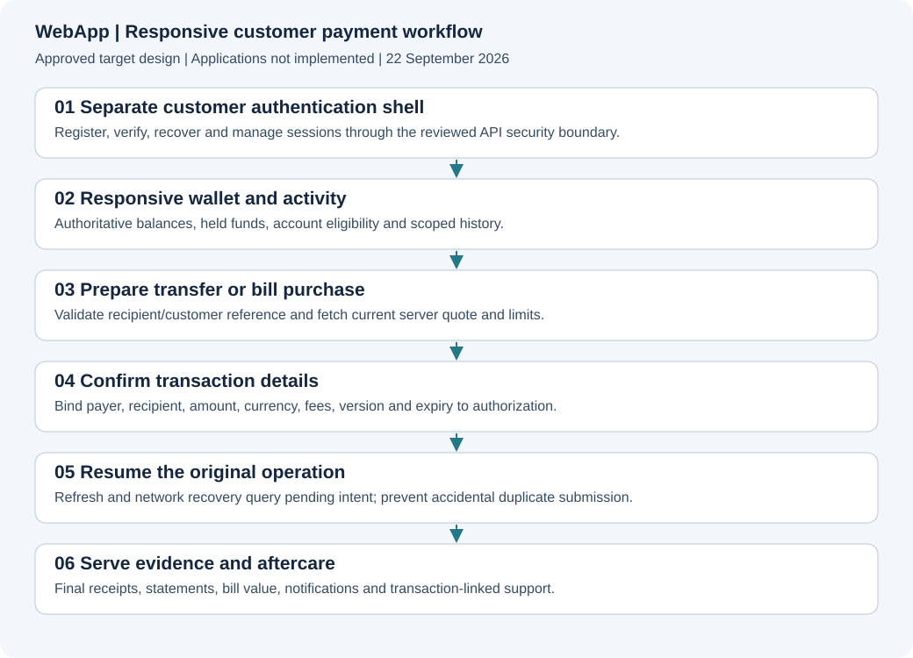

# WebApp

**Status: approved documentation and scaffold.** No runnable application, real product screenshots, implementation tests, provider acceptance or deployment is delivered here. The approved stack is recorded below.

[Project](../README.md) · [Documentation](../devdocs/00-INDEX.md) · [Service specification](../devdocs/WebApp/00-INDEX.md)

**Approved stack:** React + TypeScript + Vite + React Router (W1). See [ADR-0001](../devdocs/adrs/0001-APPROVED-ARCHITECTURE.md). Alternative stacks are decision history. Product features remain Planned.

## Purpose and boundaries
Responsive authenticated customer web application. Approved stack: **W1: React + TypeScript + Vite + React Router; approved 2026-09-22**. Financial authority, execution ownership and data boundaries are defined in [Architecture](../devdocs/project/03-ARCHITECTURE.md). Role owner: WebApp engineering; named assignee is unassigned. Financial/security decisions require independent domain review.

## Architecture and visuals

Use the [target architecture](../devdocs/project/03-ARCHITECTURE.md) and [UX/screen inventory](../devdocs/project/09-UX-AND-SCREEN-PLAN.md). These are designs, not screenshots of implemented services. Runtime gallery: not captured. APIbackend uses API/sequence evidence rather than a fictional GUI. Screen provenance is mandatory when executable UI exists.

## Setup, configuration and commands
No application install/build/start command exists yet. Do not invent one or present a mock as an installed product. With the first application implementation, add prerequisites, pinned versions, environment-variable names with safe examples, migrations, local fixtures, development/build/test commands and troubleshooting. Never include live keys or customer data. Documentation-only commands exist in [scripts/docs](../scripts/docs/README.md).

## Source and API map
Application source and executable contracts are not yet created. See [API contract plan](../devdocs/project/06-API-CONTRACT-PLAN.md). Publish actual source paths, entry points, module boundaries and generated-client ownership when implemented. Browser/native secrets and direct database financial mutations are forbidden.

## Feature and task register
Core scope is approved for planning; every entry below remains unimplemented. Growth rows are epics needing decomposition and explicit approval. Service role ownership applies to all rows; dependencies follow [milestones](../devdocs/project/12-ROADMAP.md) and must be expanded in issues before sprint commitment. Source/test/issue evidence is intentionally absent. Verification: Not run. Provider acceptance: Not assessed. Release: Not deployed.

<!-- FEATURES:START -->
| ID | Capability / task | Milestone | Priority | Status | Specification | Acceptance and required verification | Source / tests / issue |
|---|---|---|---|---|---|---|---|
| WEB-001 | Independent web and authentication shells | M1 | P0 | Planned | [Specification](../devdocs/WebApp/00-INDEX.md) | Login recovery and verification exclude authenticated navigation | Not implemented; tests not run; issue not created |
| WEB-002 | Registration verification and login | M1 | P0 | Planned | [Specification](../devdocs/WebApp/00-INDEX.md) | Validate safe errors expiry resend and authenticated entry | Not implemented; tests not run; issue not created |
| WEB-003 | Session MFA and device controls | M1 | P0 | Planned | [Specification](../devdocs/WebApp/00-INDEX.md) | Secure session CSRF origin and revocation policies pass | Not implemented; tests not run; issue not created |
| WEB-004 | Customer KYC workflow | M2 | P0 | Planned | [Specification](../devdocs/WebApp/00-INDEX.md) | Upload and verification flow handles failures and review without data leaks | Not implemented; tests not run; issue not created |
| WEB-005 | Wallet and funding instructions | M2 | P0 | Planned | [Specification](../devdocs/WebApp/00-INDEX.md) | Show authoritative scoped available held and funding states | Not implemented; tests not run; issue not created |
| WEB-006 | Beneficiaries and name enquiry | M2 | P0 | Planned | [Specification](../devdocs/WebApp/00-INDEX.md) | Customer ownership and current verified recipient details are enforced | Not implemented; tests not run; issue not created |
| WEB-007 | Transfer quote and authorisation | M2 | P0 | Planned | [Specification](../devdocs/WebApp/00-INDEX.md) | Display exact fees and reject changed expired or unapproved intents | Not implemented; tests not run; issue not created |
| WEB-008 | Transfer pending and refresh recovery | M2 | P0 | Planned | [Specification](../devdocs/WebApp/00-INDEX.md) | Browser refresh and duplicate click recover existing operation safely | Not implemented; tests not run; issue not created |
| WEB-009 | Bill discovery and validation | M3 | P0 | Planned | [Specification](../devdocs/WebApp/00-INDEX.md) | Render approved categories products and category-specific validation | Not implemented; tests not run; issue not created |
| WEB-010 | Bill vend and token recovery | M3 | P0 | Planned | [Specification](../devdocs/WebApp/00-INDEX.md) | Show pending and fulfilment honestly and recover delayed token | Not implemented; tests not run; issue not created |
| WEB-011 | Receipts and controlled downloads | M3 | P0 | Planned | [Specification](../devdocs/WebApp/00-INDEX.md) | Only authoritative completed evidence generates a success receipt | Not implemented; tests not run; issue not created |
| WEB-012 | History search and transaction details | M2 | P0 | Planned | [Specification](../devdocs/WebApp/00-INDEX.md) | Filters pagination and timelines remain scoped and accurate | Not implemented; tests not run; issue not created |
| WEB-013 | Statement and export jobs | M3 | P1 | Planned | [Specification](../devdocs/WebApp/00-INDEX.md) | Exports are complete scoped and delivered through expiring authorisation | Not implemented; tests not run; issue not created |
| WEB-014 | In-app notification centre | M2 | P0 | Planned | [Specification](../devdocs/WebApp/00-INDEX.md) | Read status and deep links remain secure and separate from payment execution | Not implemented; tests not run; issue not created |
| WEB-015 | Support complaints and disputes | M3 | P0 | Planned | [Specification](../devdocs/WebApp/00-INDEX.md) | Linked cases support escalation and audited resolution | Not implemented; tests not run; issue not created |
| WEB-016 | Privacy security and account settings | M3 | P0 | Planned | [Specification](../devdocs/WebApp/00-INDEX.md) | Settings reflect actual backend policy and retention constraints | Not implemented; tests not run; issue not created |
| WEB-017 | Browser security and cache policy | M1 | P0 | Planned | [Specification](../devdocs/WebApp/00-INDEX.md) | CSP CSRF origin and private caching rules prevent cross-session exposure | Not implemented; tests not run; issue not created |
| WEB-018 | Responsive and accessible UX | M1 | P0 | Planned | [Specification](../devdocs/WebApp/00-INDEX.md) | Keyboard assistive and narrow-screen journeys cover errors and pending states | Not implemented; tests not run; issue not created |
| WEB-019 | Contract component and browser tests | M1 | P0 | Planned | [Specification](../devdocs/WebApp/00-INDEX.md) | Real integration paths use maintained generated contracts and deterministic tests | Not implemented; tests not run; issue not created |
| WEB-020 | Screenshot capture and deployment | M4 | P0 | Planned | [Specification](../devdocs/WebApp/00-INDEX.md) | Publish synthetic runtime evidence with source hash and clean deployment proof | Not implemented; tests not run; issue not created |
| WEB-021 | Approved business and growth journeys | M5 | P1 | Planned | [Specification](../devdocs/WebApp/00-INDEX.md) | Split selected products into end-to-end web and operations tasks | Not implemented; tests not run; issue not created |
<!-- FEATURES:END -->

## Done, pending and blocked
Documentation: this planning README and task register are drafted. Product implementation: zero tasks completed. Pending: 21 planned rows. Decisions: stack and E1 integration approved; contracts, operating authority and provider acceptance remain unresolved. Do not confuse these programme gates with a running system failure. Link named blockers and dependencies as implementation begins.

## Tests and evidence
Product tests: not written or run. [Acceptance plan](../devdocs/project/10-TESTING-AND-ACCEPTANCE.md) defines required suites. Record commit, exact commands, environment, totals and skips; source-discovered tests are not executed results. No financial or security certification is implied by documentation checks.

## Security and permissions
Adopt the [security plan](../devdocs/project/07-SECURITY-AND-COMPLIANCE.md). Separate customer and staff authentication. Enforce API authorisation, object ownership, sensitive-data controls and audited privileged operations. Document a detailed permission matrix before feature implementation.

## Operations, deployment and troubleshooting
Not deployed. Use the [operations plan](../devdocs/project/11-OPERATIONS-AND-DEPLOYMENT.md) to create service-specific release, rollback, logging, incident, key-recovery and data-recovery procedures. Do not modify production to create documentation evidence.

## Roadmap, limitations and maintenance
See [roadmap](../devdocs/project/12-ROADMAP.md). This README is the canonical detailed register; generated FEATURES.json is derived. Root and service statuses, tests, API docs and changed UI captures must accompany every feature delivery. See the [mandatory standard](../devdocs/project/13-DOCUMENTATION-STANDARD.md).

## Changelog
2026-09-22: service boundary, approved stack, acceptance tasks and mandatory documentation obligations recorded. Approved stack recorded and documentation/scaffold prepared for GitHub; no product implementation claimed.

### Self-hosted notification integration
Integrate the selected self-hosted inbox SDK, authenticated detail links and Go-owned preferences/unsubscribe journeys. Receipt emails must not replace server-authoritative transaction state.

The permanent service directory is [Novu](../Novu/README.md), not `Notifications/`. Read [notification contracts](../devdocs/Novu/04-CONTRACTS-AND-DELIVERY.md). Built-in email content is not evidence that this application integration is complete.
