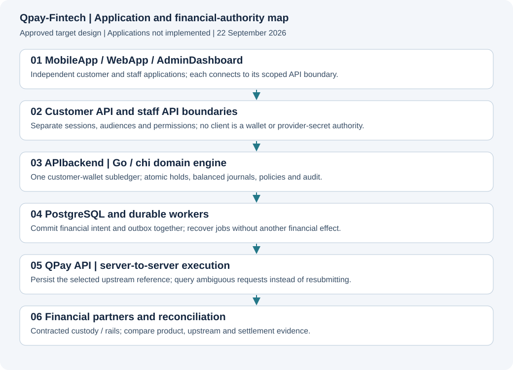

# Approved target architecture
Status: approved architectural direction; not a deployed topology. See [ADR-0001](../adrs/0001-APPROVED-ARCHITECTURE.md).

[Diagram source and rendering policy](../../docs/diagrams/README.md). The arrows show conceptual flow and responsibility, not all network connections or a deployed topology. Staff and customer requests have separate authentication boundaries.

## Deployment model
Start with a modular Go monolith: separate API, worker and scheduler processes from one codebase, one domain model and one financial migration authority. Separate deployable frontend applications. Do not create dozens of network microservices before operational ownership and capacity require them.

Modules: identity, KYC, customer accounts, ledger, funding, transfers, bills, pricing, limits, risk, reconciliation, treasury, support, notifications, audit and reporting. Modules use explicit interfaces. They must not mutate another module's tables through shortcuts.

PostgreSQL is selected for transactional records. Use transactions, uniqueness constraints, locking/isolation and bounded retries around ledger decisions. A cache or queue is not the balance authority. Start durable work from a transactional outbox/inbox; optional Redis/Valkey is for suitable caching and distributed abuse controls, not customer funds. Add a broker only when justified. Private S3-compatible storage holds controlled documents and exports, not public KYC URLs. Provider secrets belong in controlled server-side secret storage with rotation and scoped access.

## Authority
| Actor | Allowed ownership | Forbidden shortcut |
|---|---|---|
| APIbackend | Product customers, wallet subledger, intents, holds, policies, operations and evidence | Treating the display balance as the ledger or equating a timeout with failure |
| MobileApp/WebApp | UI, secure session handling, local presentation state | Provider/API master secrets, locally approving a debit, offline money execution |
| AdminDashboard | Authorised views, proposed policy/actions and review workflows | Direct SQL financial writes or unaudited balance edits |
| QPay upstream | Its contractually defined routing/execution and application accounting | Shared mutable customer wallet tables across products |
| Financial partner | Legally defined account/custody/rail responsibilities | Assuming API access gives this app an independent banking authorisation |

If a Laravel/Next/Svelte server layer is selected, treat it as a session/presentation boundary, not a parallel payment engine. Separate staff and customer cookie/token audiences and origins. Do not send customer tokens to staff APIs. Restrict privileged endpoints independently of hidden UI buttons.

## Failure boundaries
Async operations return accepted/pending state rather than fictional final success. Record the selected execution owner, idempotency intent, provider reference, request fingerprint and immutable observations. Re-query ambiguous submissions; do not fail over to a fresh payout. Payment state, settlement state, bill fulfilment and notification delivery are distinct.

Web/mobile share published schemas, error codes and safe validation helpers. Admin and web may share an accessible browser component package. Native and browser UI need their own screens and platform tests.

## Additive notification boundary
Go commits business facts and notification intent together. Self-hosted Novu orchestrates email through our signed bridge and provider; provider callbacks feed Go delivery records, never financial state. Use separately controlled customer/staff audiences and an independent incident path. The original four-application diagram is not a deployment map of the new service.

See the [Novu specification index](../Novu/00-INDEX.md) and [service task register](../../Novu/README.md).
